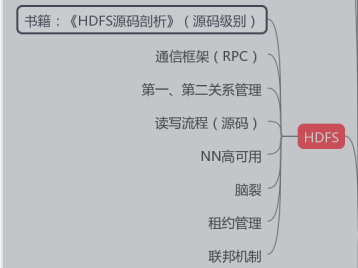

## 书籍：《HDFS源码剖析》（源码级别）

#### 1.在HDFS里面，data node上的块大小默认是64MB(或者是128MB或256MB)。问题: 为什么64MB(或128MB或256MB)是最优选择？

a.为什么不能远少于64MB(或128MB或256MB) （普通文件系统的数据块大小一般为4KB）减少硬盘寻道时间(disk seek time)

```
	1.合适的块大小有助于减少硬盘寻道时间，提高系统吞吐量：
	HDFS设计前提是支持大容量的流式数据操作，所以即使是一般的数据读写操作，涉及到的数据量都是比较大的。假如数据块设置过少，那需要读取的数据块就比较多，由于数据块在硬盘上非连续存储，普通硬盘因为需要移动磁头，所以随机寻址较慢，读越多的数据块就增大了总的硬盘寻道时间。当硬盘寻道时间比io时间还要长的多时，那么硬盘寻道时间就成了系统的一个瓶颈。所以合适的块大小有助于减少硬盘寻道时间，提高系统吞吐量。
	2.减少Namenode内存消耗：
	对于HDFS，他只有一个Namenode节点，他的内存相对于Datanode来说，是极其有限的。然而，namenode需要在其内存FSImage文件中中记录在Datanode中的数据块信息，假如数据块大小设置过少，而需要维护的数据块信息就会过多，那Namenode的内存可能就会伤不起了。
```

​	b.为什么不能远大于64MB(或128MB或256MB)？

```
这里主要从上层的MapReduce框架来讨论：
	1.Map崩溃问题：
	系统需要重新启动，启动过程需要重新加载数据，数据块越大，数据加载时间越长，系统恢复过程越长。
	2.监管时间问题：
    主节点监管其他节点的情况，每个节点会周期性的把完成的工作和状态的更新报告回来。如果一个节点保持沉默超过一个预设的时间间隔，主节点记录下这个节点状态为死亡，并把分配给这个节点的数据发到别的节点。对于这个“预设的时间间隔”，这是从数据块的角度大概估算的。假如是对于64MB的数据块，我可以假设你10分钟之内无论如何也能解决了吧，超过10分钟也没反应，那就是死了。可对于640MB或是1G以上的数据，我应该要估算个多长的时间内？估算的时间短了，那就误判死亡了，分分钟更坏的情况是所有节点都会被判死亡。估算的时间长了，那等待的时间就过长了。所以对于过大的数据块，这个“预设的时间间隔”不好估算。
	3.问题分解问题：
	数据量大小是问题解决的复杂度是成线性关系的。对于同个算法，处理的数据量越大，它的时间复杂度也就越大。
 	4.约束Map输出：
    在Map Reduce框架里，Map之后的数据是要经过排序才执行Reduce操作的。想想归并排序算法的思想，对小文件进行排序，然后将小文件归并成大文件的思想，然后就会懂这点了。
    对于这个问题其实我想应该还有很多方面的思考的~ 对HDFS了解不深.
```

