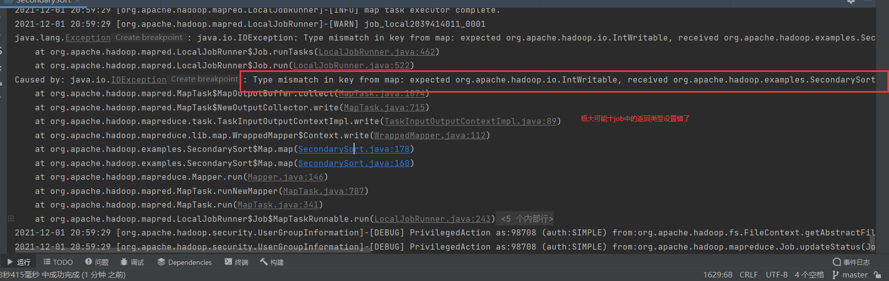
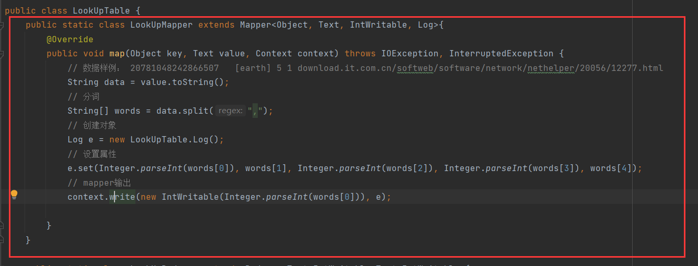
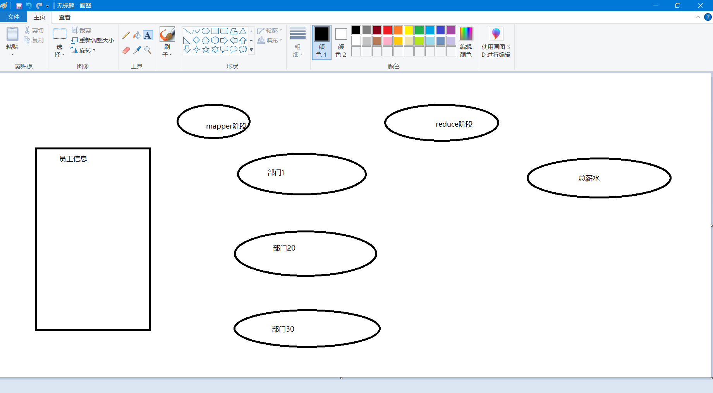

# 注意（总结）：

***1. Hadoop提供的reduce函数中Iterable 接口只能遍历一次的问题***

***2.实验八日志文件，最好使用正则去匹配所需要的数据***

***3.***




## 模板：

```
// mapper:
public static class LookUpMapper extends Mapper<Object, Text, Text, IntWritable>{
        @Override
        public void map(Object key, Text value, Context context){
            // 数据样例： 20781048242866507	[earth]	5 1	download.it.com.cn/softweb/software/network/nethelper/20056/12277.html
            String data = value.toString();
            // 分词
            String[] words = data.split(",");
            // 创建对象
            // 设置属性
            // mapper输出

        }
    }
```



```
// reduce:
public static class LookUpReducer extends Reducer<Text,IntWritable,Text,IntWritable>{
        @Override
        public void reduce(Text key, Iterable<IntWritable> values, Context context){

        }
    }
```


```
// mian:
public static void main(String[] args) throws Exception{
        Configuration conf = new Configuration();

        Job job = Job.getInstance(conf, "LookUpTable"); // 实例化一道作业
        job.setJarByClass(TopScore.class);

        // 指定job的mapper的输出的类型 k2 v2
        job.setMapperClass(LookUpTable.LookUpMapper.class); // 设置Mapper类
        job.setMapOutputKeyClass(Text.class);
        job.setMapOutputValueClass(IntWritable.class);

        // 指定job的reducer的输出的类型 k4 v4
        job.setReducerClass(LookUpTable.LookUpReducer.class);// 设置ReducerClass类
        job.setOutputKeyClass(Text.class);// 输出key的类型
        job.setOutputValueClass(IntWritable.class);// 输出value的类型


        // 集群
//        FileInputFormat.addInputPath(job, new Path(otherArgs[0]));
//        FileOutputFormat.setOutputPath(job, new Path(otherArgs[1]));

        // 本地测试
        FileInputFormat.setInputPaths(job, new Path("C:\\Users\\98708\\Desktop\\access_log.20060805.decode.filter"));
        FileOutputFormat.setOutputPath(job, new Path("C:\\Users\\98708\\Desktop\\output"));

        System.exit(job.waitForCompletion(true) ? 0 : 1);
    }
```

```
# 对象
public static class Log implements Writable {
        // 数据类型：用户ID  [查询词]  该URL在返回结果中的排名  用户点击的顺序 用户点击的URL
        // 数据样例：20781048242866507	[earth]	5 1	download.it.com.cn/softweb/software/network/nethelper/20056/12277.html
        private int id; // 用户ID
        private String word;// [查询词]
        private int rank; // 排名
        private  int clickorder; // 用户点击的顺序
        private String url; // 用户点击的URL

        //序列化方法：将java对象转化为可跨机器传输数据流（二进制串/字节）的一种技术，通俗理解为写操作
        public void write(DataOutput out) throws IOException {
            out.writeInt(this.id);
            out.writeUTF(this.word);
            out.writeInt(this.rank);
            out.writeInt(this.clickorder);
            out.writeUTF(this.url);

        }

        //反序列化方法：将可跨机器传输数据流（二进制串）转化为java对象的一种技术,通俗理解为读操作
        public void readFields(DataInput in) throws IOException {
            this.id = in.readInt();
            this.word = in.readUTF();
            this.rank = in.readInt();
            this.clickorder= in.readInt();
            this.url = in.readUTF();
        }

        public void set(int id, String word, int rank, int clickorder, String url){
            this.id = id;
            this.word = word;
            this.rank = rank;
            this.clickorder = clickorder;
            this.url = url;
        }

        public int getId(){
            return id;
        }

        public String getWord(){
            return word;
        }

        public int getRank(){
            return rank;
        }

        public int getClickorder(){
            return clickorder;
        }

        public String getUrl() {
            return url;
        }
    }
```


## **实验四： WordCOunt**

```java
/*
  Licensed to the Apache Software Foundation (ASF) under one
  or more contributor license agreements.  See the NOTICE file
  distributed with this work for additional information
  regarding copyright ownership.  The ASF licenses this file
  to you under the Apache License, Version 2.0 (the
  "License"); you may not use this file except in compliance
  with the License.  You may obtain a copy of the License at

      http://www.apache.org/licenses/LICENSE-2.0

  Unless required by applicable law or agreed to in writing, software
  distributed under the License is distributed on an "AS IS" BASIS,
  WITHOUT WARRANTIES OR CONDITIONS OF ANY KIND, either express or implied.
  See the License for the specific language governing permissions and
  limitations under the License.
 */
package org.apache.hadoop.examples;

import org.apache.hadoop.conf.Configuration;
import org.apache.hadoop.fs.Path;
import org.apache.hadoop.io.IntWritable;
import org.apache.hadoop.io.Text;
import org.apache.hadoop.mapreduce.Job;
import org.apache.hadoop.mapreduce.Mapper;

import org.apache.hadoop.mapreduce.Reducer;
import org.apache.hadoop.mapreduce.lib.input.FileInputFormat;
import org.apache.hadoop.mapreduce.lib.output.FileOutputFormat;
import org.apache.hadoop.util.GenericOptionsParser;

import java.io.IOException;
import java.util.StringTokenizer;


public class WordCount {

    public static class TokenizerMapper extends Mapper<Object, Text, Text, IntWritable>{
        private final static IntWritable one = new IntWritable(1);
        private final Text word = new Text();

        public void map(Object key, Text value, Context context) throws IOException, InterruptedException {
            StringTokenizer itr = new StringTokenizer(value.toString());
            while (itr.hasMoreTokens()) {
                word.set(itr.nextToken());
                context.write(word, one);
            }
        }
    }

    public static class IntSumReducer extends Reducer<Text,IntWritable,Text,IntWritable> {
        private final IntWritable result = new IntWritable();
        public void reduce(Text key, Iterable<IntWritable> values, Context context) throws IOException, InterruptedException {
            int sum = 0;
            for (IntWritable val : values) {
                sum += val.get();
            }
            result.set(sum);
            context.write(key, result);
        }
    }

    public static void main(String[] args) throws Exception {
        Configuration conf = new Configuration();
        String[] otherArgs = new GenericOptionsParser(conf, args).getRemainingArgs();
        if (otherArgs.length < 2) {
            System.err.println("Usage: wordcount <in> [<in>...] <out>");
            System.exit(2);
        }
        // 实例化一道作业
        Job job = Job.getInstance(conf, "word count");
        job.setJarByClass(WordCount.class);
        // Mapper类型
        job.setMapperClass(TokenizerMapper.class);
        //
        job.setCombinerClass(IntSumReducer.class);
        // Reducer类型
        job.setReducerClass(IntSumReducer.class);
        // reduce输出Key类型
        job.setOutputKeyClass(Text.class);
        // reduce输出Value类型
        job.setOutputValueClass(IntWritable.class);
        for (int i = 0; i < otherArgs.length - 1; ++i) {
            FileInputFormat.addInputPath(job, new Path(otherArgs[i]));
        }
//        FileInputFormat.setInputPaths(job, new Path("C:\\Users\\98708\\Desktop\\word.txt"));
        FileOutputFormat.setOutputPath(job,
                new Path(otherArgs[otherArgs.length - 1]));
//        FileOutputFormat.setOutputPath(job, new Path("C:\\Users\\98708\\Desktop\\output"));
        System.exit(job.waitForCompletion(true) ? 0 : 1);
    }
}
```

## **实验五： TopScore**

```java
package org.apache.hadoop.examples;

import java.io.IOException;

import org.apache.hadoop.fs.Path;
import org.apache.hadoop.io.IntWritable;
import org.apache.hadoop.io.LongWritable;
import org.apache.hadoop.io.Text;
import org.apache.hadoop.mapreduce.Job;
import org.apache.hadoop.mapreduce.Mapper;
import org.apache.hadoop.mapreduce.Reducer;
import org.apache.hadoop.conf.Configuration;
import org.apache.hadoop.mapreduce.lib.input.FileInputFormat;
import org.apache.hadoop.mapreduce.lib.output.FileOutputFormat;
import org.apache.hadoop.util.GenericOptionsParser;


public class TopScore {

    public static class AccessSortMapper extends Mapper<LongWritable, Text, Text, IntWritable> {
        Text course = new Text();
        IntWritable score = new IntWritable();

        @Override
        protected void map(LongWritable key, Text value, Context context) throws IOException, InterruptedException {
//            String lines = value.toString();
//            String array[] = lines.split(" ");
//            System.out.println(array);
//            int keyOutput = Integer.parseInt(array[1]); //提取访问次数做为Key
//            String valueOutput = array[0];              //提取访问日期做为Values
//            context.write(new IntWritable(keyOutput), new Text(valueOutput));
            String[] values = value.toString().trim().split(" ");
            course.set(values[0]);
            score.set(Integer.parseInt(values[1])); // 将字符转换为int类型，再将score设置为该值
            context.write(course, score);
        }
    }

    public static class AccessSortReducer extends Reducer<Text, IntWritable,Text,IntWritable> {
        @Override
        protected void reduce(Text key, Iterable<IntWritable> values, Context context) throws IOException, InterruptedException {
            int maxScore = -1;
            Text course = new Text();
            for (IntWritable score:values){
                if (score.get() > maxScore){
                    maxScore = score.get();
                    course = key;
                }
            }

            context.write(course, new IntWritable(maxScore));
        }
    }


    public static void main(String[] args) throws IOException, InterruptedException, ClassNotFoundException {
        Configuration conf = new Configuration();
        String[] otherArgs = new GenericOptionsParser(conf, args).getRemainingArgs();
//        if (otherArgs.length < 2) {
//            System.out.println("使用方法: wordcount <in> [<in>...] <out>");
//            System.exit(2);
//        }

        Job job = Job.getInstance(conf, "TopScore"); // 实例化一道作业
        job.setJarByClass(TopScore.class);

        // 指定job的mapper的输出的类型 k2 v2
        job.setMapperClass(AccessSortMapper.class); // 设置Mapper类
        job.setMapOutputKeyClass(Text.class);
        job.setMapOutputValueClass(IntWritable.class);

        // 指定job的reducer的输出的类型 k4 v4
        job.setReducerClass(AccessSortReducer.class);// 设置ReducerClass类
        job.setOutputKeyClass(Text.class);// 输出key的类型
        job.setOutputValueClass(IntWritable.class);// 输出value的类型

        // 是否引入合并操作
        job.setCombinerClass(AccessSortReducer.class); // TopScore的reduce

        // 集群
//        FileInputFormat.addInputPath(job, new Path(otherArgs[0]));
//        FileOutputFormat.setOutputPath(job, new Path(otherArgs[1]));

        // 本地测试
        FileInputFormat.setInputPaths(job, new Path("C:\\Users\\98708\\Desktop\\score.txt"));
        FileOutputFormat.setOutputPath(job, new Path("C:\\Users\\98708\\Desktop\\output"));

        System.exit(job.waitForCompletion(true) ? 0 : 1);
    }
}
```

## **实验六 MapReduce的序列化编程和分区**

### 1.统计各个部门的总薪水



### 2.按照薪水的高低分类，分区存储

```java
package org.apache.hadoop.examples;

import org.apache.hadoop.conf.Configuration;
import org.apache.hadoop.fs.Path;
import org.apache.hadoop.io.IntWritable;
import org.apache.hadoop.io.LongWritable;
import org.apache.hadoop.io.Text;
import org.apache.hadoop.io.Writable;
import org.apache.hadoop.mapreduce.Job;
import org.apache.hadoop.mapreduce.Mapper;
import org.apache.hadoop.mapreduce.Partitioner;
import org.apache.hadoop.mapreduce.Reducer;
import org.apache.hadoop.mapreduce.lib.input.FileInputFormat;
import org.apache.hadoop.mapreduce.lib.output.FileOutputFormat;
import org.apache.hadoop.util.GenericOptionsParser;

import java.io.DataInput;
import java.io.DataOutput;
import java.io.IOException;

public class Serializable {

    public static class SalaryTotalMapper extends Mapper<LongWritable, Text, IntWritable, Employee>{
        @Override
        protected void map(LongWritable key, Text value, Context context) throws IOException, InterruptedException{
            // 数据样例：7369	SMITH	CLERK	7902	1980-12-17	800		20
            String data = value.toString();
            // 分词
            String[] words = data.split(",");
            // 创建员工对象
            Employee e = new Serializable.Employee();
            // 设置员工属性,依次为 员工编号，员工姓名，职位，领导的员工编号，雇佣日期，工资，奖金，部门编号
            e.setEmpno(Integer.parseInt(words[0]));
            e.setEname(words[1]);
            e.setJob(words[2]);

            try {
                e.setMgr(Integer.parseInt(words[3])); // 可能为空
            }catch (Exception ex){
                // 没有老板
                e.setMgr(-1);
            }
            e.setHiredate(words[4]);
            // 月薪
            e.setSal(Integer.parseInt(words[5]));
            try{
                e.setComm(Integer.parseInt(words[6]));
            }catch (Exception ex){
                // 没有奖金
                e.setComm(0);
            }
            e.setDeptno(Integer.parseInt(words[7]));

            context.write(new IntWritable(e.getDeptno()), e);
        }
    }

    public static class SalaryTotalReducer extends Reducer<IntWritable, Employee, IntWritable, Employee> {
        @Override
        protected void reduce(IntWritable k3, Iterable<Employee> v3, Context context) throws IOException, InterruptedException {
//            // 取出v3中的每个员工数据， 进行工资求和
//            int total = 0;
//            for (Employee e:v3){
//                total = total + e.getSal();
//            }
//
//            // 输出
            for (Employee e: v3){
                context.write(k3, e);
            }
            // 属性,依次为 员工编号，员工姓名，职位，领导的员工编号，雇佣日期，工资，奖金，部门编号
        }
    }

    public static class SalaryParitioner extends Partitioner<IntWritable, Employee>{
        @Override
        public int getPartition(IntWritable k2, Employee v2, int numPartition){
            // 如何建立分区
            if (v2.getSal() + v2.getComm() < 1500){
                // 低薪,放入1号分区
                return 1%numPartition;
            }else if (v2.getSal() + v2.getComm() >= 1500 && v2.getSal() + v2.getComm() < 3000){
                //中薪，放入2号分区
                return 2%numPartition;
            }else{
                // 高薪，放入0号分区
                return 3%numPartition;
            }

        }

    }

    public static void main(String[] args) throws IOException, InterruptedException, ClassNotFoundException {
        Configuration conf = new Configuration();
        String[] otherArgs = new GenericOptionsParser(conf, args).getRemainingArgs();

        Job job = Job.getInstance(conf, "Serializable"); // 实例化一道作业
        job.setJarByClass(Serializable.class);

        // 指定job的mapper的输出的类型 k2 v2
        job.setMapperClass(Serializable.SalaryTotalMapper.class); // 设置Mapper类
        job.setMapOutputKeyClass(IntWritable.class);
        job.setMapOutputValueClass(Employee.class);

        // !!!!!!!!!指定分区规则
        job.setPartitionerClass(Serializable.SalaryParitioner.class);
        // !!!!!!!!!指定建立几个分区
        job.setNumReduceTasks(3);

        // 指定job的reducer的输出的类型 k4 v4
        job.setReducerClass(Serializable.SalaryTotalReducer.class);// 设置ReducerClass类
        job.setOutputKeyClass(IntWritable.class);// 输出key的类型， 部门号
        job.setOutputValueClass(IntWritable.class);// 输出value的类型， 员工

        // 集群
//        FileInputFormat.addInputPath(job, new Path(otherArgs[0]));
//        FileOutputFormat.setOutputPath(job, new Path(otherArgs[1]));

        // 本地测试
        FileInputFormat.setInputPaths(job, new Path("C:\\Users\\98708\\Desktop\\emp.csv"));
        FileOutputFormat.setOutputPath(job, new Path("C:\\Users\\98708\\Desktop\\output2"));

        // 执行任务
        job.waitForCompletion(true);

    }

    public static class Employee implements Writable {
        //字段名 EMPNO, ENAME,    JOB,   MGR,   HIREDATE,  SAL, COMM, DEPTNO
        //数据类型：Int，Char，          Char  ， Int，     Date  ，       Int   Int，  Int
        //数据: 7654, MARTIN, SALESMAN, 7698, 1981/9/28, 1250, 1400, 30
        //由以上定义变量
        // 数据样例：7369	SMITH	CLERK	7902	1980-12-17	800		20
        private int empno;
        private String ename;
        private String job;
        private int mgr;
        private String hiredate;
        private int sal;
        private int comm;//奖金
        private int deptno;


        @Override
        public String toString() {
            int total=comm+sal;
//		return "Employee [empno=" + empno + ", ename=" + ename + ", sal=" + sal + ", deptno=" + deptno + "]";
            return empno+","+ename+","+job+","+mgr+","+hiredate+","+sal+","+comm+","+deptno+","+total;
        }


        //序列化方法：将java对象转化为可跨机器传输数据流（二进制串/字节）的一种技术，通俗理解为写操作
        public void write(DataOutput out) throws IOException {
            out.writeInt(this.empno);
            out.writeUTF(this.ename);
            out.writeUTF(this.job);
            out.writeInt(this.mgr);
            out.writeUTF(this.hiredate);
            out.writeInt(this.sal);
            out.writeInt(this.comm);
            out.writeInt(this.deptno);

        }
        //反序列化方法：将可跨机器传输数据流（二进制串）转化为java对象的一种技术,通俗理解为读操作
        public void readFields(DataInput in) throws IOException {
            this.empno = in.readInt();
            this.ename = in.readUTF();
            this.job = in.readUTF();
            this.mgr = in.readInt();
            this.hiredate = in.readUTF();
            this.sal = in.readInt();
            this.comm = in.readInt();
            this.deptno = in.readInt();
        }

        //其他类通过set/get方法操作变量：Source-->Generator Getters and Setters
        public int getEmpno() {
            return empno;
        }
        public void setEmpno(int empno) {
            this.empno = empno;
        }
        public String getEname() {
            return ename;
        }
        public void setEname(String ename) {
            this.ename = ename;
        }
        public String getJob() {
            return job;
        }
        public void setJob(String job) {
            this.job = job;
        }
        public int getMgr() {
            return mgr;
        }
        public void setMgr(int mgr) {
            this.mgr = mgr;
        }
        public String getHiredate() {
            return hiredate;
        }
        public void setHiredate(String hiredate) {
            this.hiredate = hiredate;
        }
        public int getSal() {
            return sal;
        }
        public void setSal(int sal) {
            this.sal = sal;
        }
        public int getComm() {
            return comm;
        }
        public void setComm(int comm) {
            this.comm = comm;
        }
        public int getDeptno() {
            return deptno;
        }
        public void setDeptno(int deptno) {
            this.deptno = deptno;
        }
    }
}
```


## **实验七  MapReduce编程统计各年销售笔数和销售总额**

```java
package org.apache.hadoop.examples;


import org.apache.hadoop.conf.Configuration;
import org.apache.hadoop.fs.Path;
import org.apache.hadoop.io.IntWritable;
import org.apache.hadoop.io.LongWritable;
import org.apache.hadoop.io.Text;
import org.apache.hadoop.io.Writable;
import org.apache.hadoop.mapreduce.Job;
import org.apache.hadoop.mapreduce.Mapper;
import org.apache.hadoop.mapreduce.Partitioner;
import org.apache.hadoop.mapreduce.Reducer;
import org.apache.hadoop.mapreduce.lib.input.FileInputFormat;
import org.apache.hadoop.mapreduce.lib.output.FileOutputFormat;
import org.apache.hadoop.util.GenericOptionsParser;

import java.io.DataInput;
import java.io.DataOutput;
import java.io.IOException;

public class SalesStatistics {

    public static class SalesTotalMapper extends Mapper<LongWritable, Text, Text, Order> {
        @Override
        protected void map(LongWritable key, Text value, Context context) throws IOException, InterruptedException{
            // 数据样例：13	987	1998-1-10	3	999	1	1232.16
            String data = value.toString();
            // 分词
            String[] words = data.split(",");
            // 创建员工对象
            Order e = new SalesStatistics.Order();
            // 设置订单属性,产品ID，客户ID，订单日期，渠道ID，促销ID，销售数量，销售总额
            e.set(Integer.parseInt(words[0]), Integer.parseInt(words[1]), words[2], Integer.parseInt(words[3]), Integer.parseInt(words[4]), Integer.parseInt(words[5]), Double.parseDouble(words[6]));
            String year = words[2].split("-")[0];
            context.write(new Text(year), e);
        }
    }

    public static class SalesTotalReducer extends Reducer<Text, Order, Text, Text> {
        @Override
        protected void reduce(Text k3, Iterable<Order> v3, Context context) throws IOException, InterruptedException {
            int total_sales = 0;
            double total_count = 0;
            for (Order e: v3){
                total_sales = total_sales + e.getSalesVolume();
                total_count = total_count + e.getSalesCount();
                System.out.println("标记：" + e.getSalesCount());
            }

//            double total_count = 0;
//            for (Order e: v3){
//                System.out.println("标记：" + e.getSalesCount());
//                total_count = total_count + e.getSalesCount();
//            }

            context.write(k3, new Text(String.valueOf(total_sales) + " " + total_count));
        }
    }

    public static void main(String[] args) throws IOException, InterruptedException, ClassNotFoundException {
        Configuration conf = new Configuration();
        String[] otherArgs = new GenericOptionsParser(conf, args).getRemainingArgs();

        Job job = Job.getInstance(conf, "SalesStatistics"); // 实例化一道作业
        job.setJarByClass(org.apache.hadoop.examples.SalesStatistics.class);

        // 指定job的mapper的输出的类型 k2 v2
        job.setMapperClass(SalesStatistics.SalesTotalMapper.class); // 设置Mapper类
        job.setMapOutputKeyClass(Text.class);
        job.setMapOutputValueClass(SalesStatistics.Order.class);


        // 指定job的reducer的输出的类型 k4 v4
        job.setReducerClass(SalesStatistics.SalesTotalReducer.class);// 设置ReducerClass类
        job.setOutputKeyClass(Text.class);// 输出key的类型， 部门号
        job.setOutputValueClass(Text.class);// 输出value的类型， 员工

        // 集群
//        FileInputFormat.addInputPath(job, new Path(otherArgs[0]));
//        FileOutputFormat.setOutputPath(job, new Path(otherArgs[1]));

        // 本地测试
        FileInputFormat.setInputPaths(job, new Path("C:\\Users\\98708\\Desktop\\sales.csv"));
        FileOutputFormat.setOutputPath(job, new Path("C:\\Users\\98708\\Desktop\\output"));

        // 执行任务
        job.waitForCompletion(true);

    }

    public static class Order implements Writable {
        // 订单类
        /*
        * 订单的数据描述如下：产品ID，客户ID，订单日期，渠道ID，促销ID，销售数量，销售总额
        * */
        // 数据样例 13	987	1998-1-10	3	999	 1	1232.16
        private int pid;// 产品ID(product)
        private int cid;// 客户ID(client)
        private String hiredate; // 订单日期
        private int chid;// 渠道ID(channel)
        private int prid;// 促销ID(Promotion)
        private int  SalesVolume;// 销售数量
        private double SalesCount;// 销售总额


        //序列化方法：将java对象转化为可跨机器传输数据流（二进制串/字节）的一种技术，通俗理解为写操作
        public void write(DataOutput out) throws IOException {
            out.writeInt(this.pid);
            out.writeInt(this.cid);
            out.writeUTF(this.hiredate);
            out.writeInt(this.chid);
            out.writeInt(this.prid);
            out.writeInt(this.SalesVolume);
            out.writeDouble(this.SalesCount);

        }
        //反序列化方法：将可跨机器传输数据流（二进制串）转化为java对象的一种技术,通俗理解为读操作
        public void readFields(DataInput in) throws IOException {
            this.pid = in.readInt();
            this.cid = in.readInt();
            this.hiredate = in.readUTF();
            this.chid = in.readInt();
            this.prid = in.readInt();
            this.SalesVolume = in.readInt();
            this.SalesCount = in.readDouble();
        }

        //其他类通过set/get方法操作变量：Source-->Generator Getters and Setters
        public int getPid() {
            return pid;
        }
        public int getCid() {
            return cid;
        }
        public String getHiredate(){
            return hiredate;
        }
        public int getChid(){
            return chid;
        }
        public int getPrid(){
            return prid;
        }
        public int getSalesVolume(){
            return SalesVolume;
        }
        public double getSalesCount(){
            return SalesCount;
        }

        public void set(int pid, int cid, String hiredate, int chid, int prid, int SalesVolume, double SalesCount){
            this.pid = pid;
            this.cid = cid;
            this.hiredate = hiredate;
            this.chid = chid;
            this.prid = prid;
            this.SalesVolume = SalesVolume;
            this.SalesCount = SalesCount;
        }

    }
}
```

## **实验八 MapReduce编程统计搜狗的搜索数据**

```
package org.apache.hadoop.examples;

import org.apache.commons.lang.ObjectUtils;
import org.apache.hadoop.conf.Configuration;
import org.apache.hadoop.fs.Path;
import org.apache.hadoop.io.IntWritable;
import org.apache.hadoop.io.NullWritable;
import org.apache.hadoop.io.Text;
import org.apache.hadoop.io.Writable;
import org.apache.hadoop.mapreduce.Job;
import org.apache.hadoop.mapreduce.Mapper;
import org.apache.hadoop.mapreduce.Reducer;
import org.apache.hadoop.mapreduce.lib.input.FileInputFormat;
import org.apache.hadoop.mapreduce.lib.output.FileOutputFormat;

import java.io.DataInput;
import java.io.DataOutput;
import java.io.IOException;
import java.util.regex.Matcher;
import java.util.regex.Pattern;

public class LookUpTable {
    public static class LookUpMapper extends Mapper<Object, Text, Text, Log>{
        @Override
        public void map(Object key, Text value, Context context) throws IOException, InterruptedException {
            // 数据样例： 20781048242866507	[earth]	5 1	download.it.com.cn/softweb/software/network/nethelper/20056/12277.html
            String data = value.toString();
            // 分词

            String[] words = data.split("\\s+");

            if (words.length != 5){
                return;
            }
//             创建对象
            Log e = new LookUpTable.Log();
//             设置属性
            e.set(words[0], words[1], Integer.parseInt(words[2]), Integer.parseInt(words[3]), words[4]);
//             mapper输出
            context.write(new Text(words[0]), e);

        }
    }

    public static class LookUpReducer extends Reducer<Text, Log, Text, Text>{
        @Override
        public void reduce(Text key, Iterable<Log> values, Context context) throws IOException, InterruptedException {
            for (Log e: values){
                if (e.rank == 2 && e.clickorder == 1){
                    context.write(key, new Text(e.word +" " + e.rank + " " + e.clickorder + " " + e.url));
                }
            }
        }
    }

    public static void main(String[] args) throws Exception{
        Configuration conf = new Configuration();

        Job job = Job.getInstance(conf, "LookUpTable"); // 实例化一道作业
        job.setJarByClass(TopScore.class);

        // 指定job的mapper的输出的类型 k2 v2
        job.setMapperClass(LookUpTable.LookUpMapper.class); // 设置Mapper类
        job.setMapOutputKeyClass(Text.class);
        job.setMapOutputValueClass(LookUpTable.Log.class);

        // 指定job的reducer的输出的类型 k4 v4
        job.setReducerClass(LookUpTable.LookUpReducer.class);// 设置ReducerClass类
        job.setOutputKeyClass(Text.class);// 输出key的类型
        job.setOutputValueClass(Text.class);// 输出value的类型


        // 集群
//        FileInputFormat.addInputPath(job, new Path(otherArgs[0]));
//        FileOutputFormat.setOutputPath(job, new Path(otherArgs[1]));

        // 本地测试
        FileInputFormat.setInputPaths(job, new Path("C:\\Users\\98708\\Desktop\\access_log.20060805.decode.filter"));
        FileOutputFormat.setOutputPath(job, new Path("C:\\Users\\98708\\Desktop\\output"));

        System.exit(job.waitForCompletion(true) ? 0 : 1);
    }

    public static class Log implements Writable {
        // 数据类型：用户ID  [查询词]  该URL在返回结果中的排名  用户点击的顺序 用户点击的URL
        // 数据样例：20781048242866507	[earth]	5 1	download.it.com.cn/softweb/software/network/nethelper/20056/12277.html
        private String id; // 用户ID
        private String word;// [查询词]
        private int rank; // 排名
        private  int clickorder; // 用户点击的顺序
        private String url; // 用户点击的URL

        //序列化方法：将java对象转化为可跨机器传输数据流（二进制串/字节）的一种技术，通俗理解为写操作
        public void write(DataOutput out) throws IOException {
            out.writeUTF(this.id);
            out.writeUTF(this.word);
            out.writeInt(this.rank);
            out.writeInt(this.clickorder);
            out.writeUTF(this.url);

        }

        //反序列化方法：将可跨机器传输数据流（二进制串）转化为java对象的一种技术,通俗理解为读操作
        public void readFields(DataInput in) throws IOException {
            this.id = in.readUTF();
            this.word = in.readUTF();
            this.rank = in.readInt();
            this.clickorder= in.readInt();
            this.url = in.readUTF();
        }

        public void set(String id, String word, int rank, int clickorder, String url){
            this.id = id;
            this.word = word;
            this.rank = rank;
            this.clickorder = clickorder;
            this.url = url;
        }

        public String getId(){
            return id;
        }

        public String getWord(){
            return word;
        }

        public int getRank(){
            return rank;
        }

        public int getClickorder(){
            return clickorder;
        }

        public String getUrl() {
            return url;
        }
    }
}
```


## **实验九 MapReduce二次排序**

```
package org.apache.hadoop.examples;

import java.io.DataInput;
import java.io.DataOutput;
import java.io.File;
import java.io.IOException;
import java.text.SimpleDateFormat;
import java.util.Date;
import java.util.StringTokenizer;

import org.apache.hadoop.conf.Configuration;
import org.apache.hadoop.fs.Path;
import org.apache.hadoop.io.IntWritable;
import org.apache.hadoop.io.LongWritable;
import org.apache.hadoop.io.Text;
import org.apache.hadoop.io.WritableComparable;
import org.apache.hadoop.io.WritableComparator;
import org.apache.hadoop.mapred.JobConf;
import org.apache.hadoop.mapreduce.Job;
import org.apache.hadoop.mapreduce.Mapper;
import org.apache.hadoop.mapreduce.Partitioner;
import org.apache.hadoop.mapreduce.Reducer;
import org.apache.hadoop.mapreduce.Job.JobState;
import org.apache.hadoop.mapreduce.lib.input.FileInputFormat;
import org.apache.hadoop.mapreduce.lib.input.TextInputFormat;
import org.apache.hadoop.mapreduce.lib.output.FileOutputFormat;
import org.apache.hadoop.mapreduce.lib.output.TextOutputFormat;


public class SecondarySort{
    /**
     * @ClassName IntPair
     * @Description 定义IntPair对象，该对象实现WritableComparable接口，描述第一列和第二列数据，同时完成两列数据的相关操作，这里是对二者进行比较
     *
     */
    public static class IntPair implements WritableComparable<IntPair> {
        int first;
        int second;

        /**
         * Set the left and right values.
         */
        public void set(int left, int right) {
            first = left;
            second = right;
        }

        public int getFirst() {
            return first;
        }

        public int getSecond() {
            return second;
        }

        @Override
        // 反序列化，从流中的二进制转换成IntPair
        public void readFields(DataInput in) throws IOException {
            // TODO Auto-generated method stub
            first = in.readInt();
            second = in.readInt();
        }

        @Override
        // 序列化，将IntPair转化成使用流传送的二进制
        public void write(DataOutput out) throws IOException {
            // TODO Auto-generated method stub
            out.writeInt(first);
            out.writeInt(second);
        }

        @Override
        // key的比较
        public int compareTo(IntPair o) {
            // TODO Auto-generated method stub
            if (first != o.first) {
                return first < o.first ? -1 : 1;
            } else if (second != o.second) {
                return second < o.second ? -1 : 1;
            } else {
                return 0;
            }
        }

        // 新定义类应该重写的两个方法，不用这个方法好像也可以
        // @Override
        // The hashCode() method is used by the HashPartitioner (the default
        // partitioner in MapReduce)
        // public int hashCode() {
        // return first * 157 + second;
        // }

        @Override
        public boolean equals(Object right) {
            if (right == null)
                return false;
            if (this == right)
                return true;
            if (right instanceof IntPair) {
                IntPair r = (IntPair) right;
                return r.first == first && r.second == second;
            } else {
                return false;
            }
        }
    }

    /**
     * 分区函数类。根据first确定Partition。
     */
    public static class FirstPartitioner extends Partitioner<IntPair, IntWritable> {
        @Override
        public int getPartition(IntPair key, IntWritable value, int numPartitions) {
            System.out.println("FirstPartitioner-----------------------------------------------");
            System.out.println("Math.abs(key.getFirst() * 127) % numPartitions: " + Math.abs(key.getFirst() * 127) % numPartitions);
            return Math.abs(key.getFirst() * 127) % numPartitions;
        }
    }

    /**
     * 分组函数类。只要first相同就属于同一个组。
     */
    /*
     * //第一种方法，实现接口RawComparator public static class GroupingComparator
     * implements RawComparator<IntPair> {
     *
     * @Override public int compare(IntPair o1, IntPair o2) { int l =
     * o1.getFirst(); int r = o2.getFirst(); return l == r ? 0 : (l < r ? -1 :
     * 1); }
     *
     * @Override //一个字节一个字节的比，直到找到一个不相同的字节，然后比这个字节的大小作为两个字节流的大小比较结果。 public int
     * compare(byte[] b1, int s1, int l1, byte[] b2, int s2, int l2){ // TODO
     * Auto-generated method stub return WritableComparator.compareBytes(b1, s1,
     * Integer.SIZE/8, b2, s2, Integer.SIZE/8); } }
     */
    // 第二种方法，继承WritableComparator
    public static class GroupingComparator extends WritableComparator {
        protected GroupingComparator() {
            super(IntPair.class, true);
            System.out.println("GroupingComparator---------------------------------");
        }

        @Override
        // Compare two WritableComparables.
        public int compare(WritableComparable w1, WritableComparable w2) {
            IntPair ip1 = (IntPair) w1;
            IntPair ip2 = (IntPair) w2;
            int l = ip1.getFirst();
            int r = ip2.getFirst();
            return l == r ? 0 : (l < r ? -1 : 1);
        }
    }

    /**
     * @ClassName Map
     * @Description 自定义map类，将每行数据进行分拆，第一列的数据存入left变量，第二列数据存入right变量
     *              在map阶段的最后，会先调用job.setPartitionerClass对这个List进行分区，每个分区映射到一个reducer
     *              。每个分区内又调用job.setSortComparatorClass设置的key比较函数类排序。可以看到，这本身就是一个二次排序。
     */
    public static class Map extends
            Mapper<LongWritable, Text, IntPair, IntWritable> {
        private final IntPair intkey = new IntPair();
        private final IntWritable intvalue = new IntWritable();
        public void map(LongWritable key, Text value, Context context)
                throws IOException, InterruptedException {
            String line = value.toString();
            // 调用java自己的工具类StringTokenizer(),将map输入的每行字符串按规则进行分割成每个字符串，这些规则有\t\n\r\f，基本上分割的结果都可以保证到最细的字符串粒度
            StringTokenizer tokenizer = new StringTokenizer(line);
            int left = 0;
            int right = 0;
            if (tokenizer.hasMoreTokens()) {
                left = Integer.parseInt(tokenizer.nextToken());
                System.out.println("left: " + left);
                if (tokenizer.hasMoreTokens())
                    right = Integer.parseInt(tokenizer.nextToken());
                intkey.set(left, right);
                intvalue.set(right);
                context.write(intkey, intvalue);
            }
        }
    }

    // 自定义reduce
    public static class Reduce extends
            Reducer<IntPair, IntWritable, Text, IntWritable> {
        private final Text left = new Text();
        private static final Text SEPARATOR = new Text("------------------------------------------------");
        public void reduce(IntPair key, Iterable<IntWritable> values,
                           Context context) throws IOException, InterruptedException {
//            context.write(SEPARATOR, null);
//            System.out.println("------------------------------------------------");
            left.set(Integer.toString(key.getFirst()));
            for (IntWritable val : values) {
                System.out.println("reduce: left " + left + "    , val " + val);
                context.write(left, val);
            }
        }
    }

    public static void main(String[] args) throws Exception{
        Configuration conf = new Configuration();

        Job job = Job.getInstance(conf, "SecondOrder"); // 实例化一道作业
        job.setJarByClass(TopScore.class);

        // 指定job的mapper的输出的类型 k2 v2
        job.setMapperClass(Map.class); // 设置Mapper类
        job.setMapOutputKeyClass(IntPair.class);
        job.setMapOutputValueClass(IntWritable.class);

        // 指定job的reducer的输出的类型 k4 v4
        job.setReducerClass(Reduce.class);// 设置ReducerClass类
        job.setOutputKeyClass(Text.class);// 输出key的类型
        job.setOutputValueClass(IntWritable.class);// 输出value的类型


        // 集群
//        FileInputFormat.addInputPath(job, new Path(otherArgs[0]));
//        FileOutputFormat.setOutputPath(job, new Path(otherArgs[1]));

        // 本地测试
        FileInputFormat.setInputPaths(job, new Path("C:\\Users\\98708\\Desktop\\SecondOrder.txt"));
        FileOutputFormat.setOutputPath(job, new Path("C:\\Users\\98708\\Desktop\\output"));

        System.exit(job.waitForCompletion(true) ? 0 : 1);
    }
}
```


## **实验十 MapReduce编程统计员工的各项数据**

```

```

