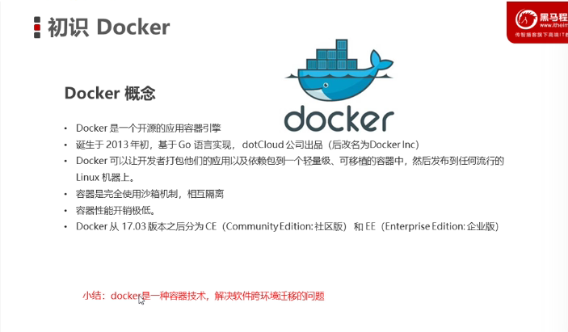
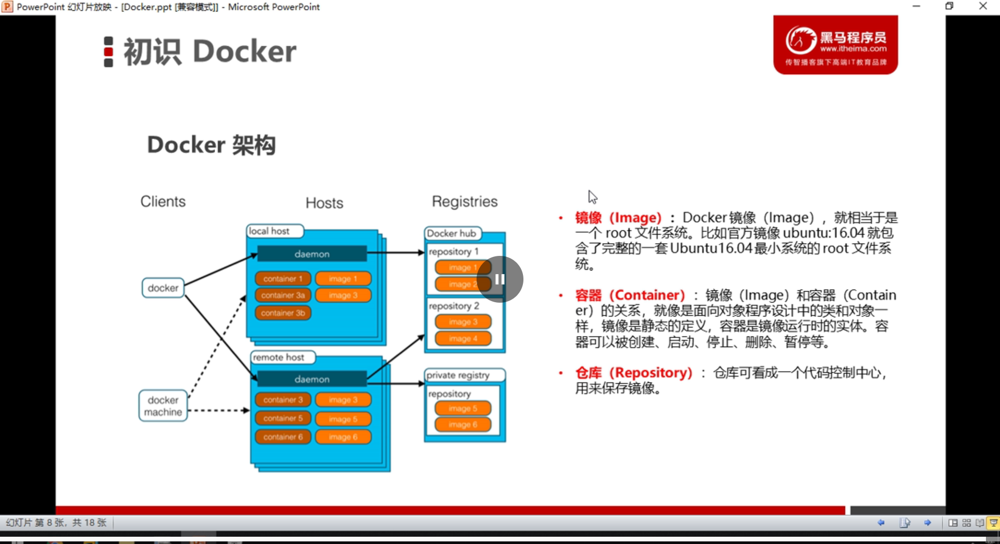
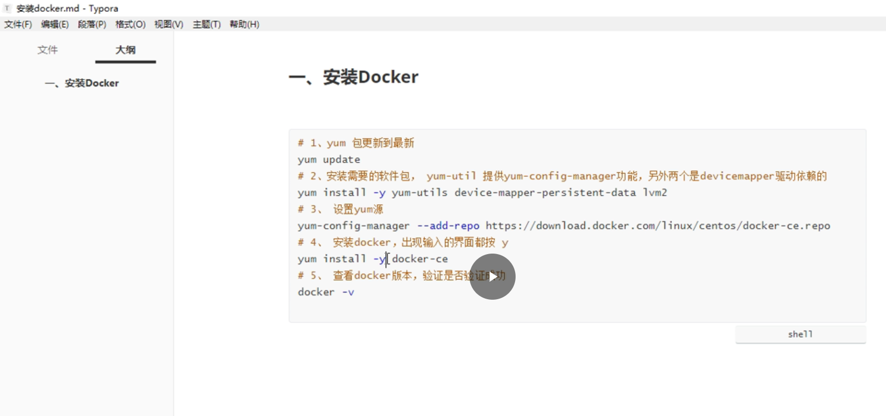
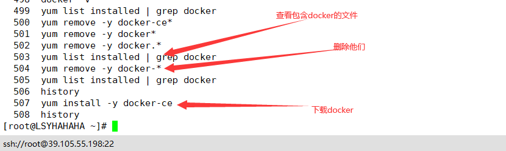
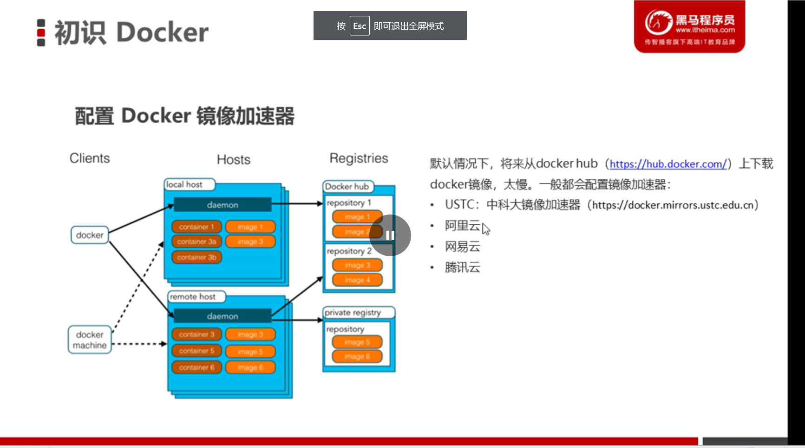

# 初始Docker

## Docker 的概念

=

**docker是一种容器技术，解决软件跨环境迁移的问题**


## Docker架构



## 安装Docker(基于CentOS 7版本)

```
# 1.yum 包更新到最新
yum update
# 2.安装需要的软件包, yum-util提供yum-config-manager功能，另外两个是devicemapper驱动依赖的
yum install -y yum-utils device-mapper-persistent-data lvm2
# 3.设置yum源
yum-config-manager --add-repo https://download.docker.com/linux/centos/docker-ce.repo
# 4.安装docker,出现输入的界面都按y
yum install -y docker-ce
# 5.查看docker版本，验证是否成功
docker -v
```





## 配置镜像加速器




# Docker命令

## Docker服务相关命令

